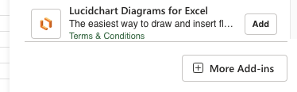
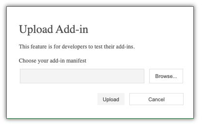

# BTAP - Blood Transfusion Automated Pairing

Streamlining the process of matching blood donations with patients using the OpenAI API. This reduces the time required to find the right blood for a patient, potentially saving lives.

## How to Use

### Installation

As this application is currently in beta, manual installation is required. The add-in will be available on Microsoft AppSource later.

1. In this repo, download `BTAPackage.zip`, unzip it, and store it in the desired location.
2. Edit the `manifest.xml` file and replace every `'path/to/file'` with the path where you stored the BTAPackage.
3. Open Excel (for the web version).
4. Select **Add-ins** on the far right of the **Home** tab.

   

5. Select **More Add-ins**.

   

6. Select **MY ADD-INS**.

   

7. Select **Upload My Add-in**.

   

8. Find the `manifest.xml` file in the BTAPackage and upload it.

   

Once completed, the add-in should appear in the ribbon on the **Home** tab.

### Using the Add-in

1. Make sure the blood donation and patient data are in the current spreadsheet and clearly labeled.
2. Select the cell where you want the response to be inserted (the top-left corner of the table).
3. Add any additional information for pairing if needed, e.g., "I want only the IDs of the pairings."
4. Reload the add-in if it’s not working and save your sheet before using it. Ensure that the pairings are always up to date.
5. Always crossmatch the pairings before transfusing blood.

## How It Works

This Excel add-in, developed using React and the Yo Office library, leverages the OpenAI API for its core functionality. To process the Excel data, the active spreadsheet range is converted into a 2D array. This array is then stringified and incorporated into the API prompt, along with any user-provided input.

Prompt engineering guides the model to match patients with blood donations based on specified attributes and user prompts. The model's string output is subsequently converted back into a 2D array and inserted into the Excel sheet at the user-defined starting coordinates.

## Research

### 1. Inspiration

This project draws significant inspiration from the UK's **Sickle Cell Awareness Month**, which aims to raise awareness about sickle cell disease (SCD) and the need for improved treatment methods. Blood transfusions are a critical therapy for SCD patients, helping to alleviate painful episodes and support normalized lives. For instance, **Tosin**, in a personal video on YouTube, documents her battle with SCD, describing the extreme pain during sickle cell crises and how regular blood transfusions are crucial to her survival (Tosin, 2022). Her story emphasizes the importance of safe and precise transfusion systems for improving patient outcomes.

Research from **NHS Blood and Transplant** (2024) highlights that the majority of SCD patients are of **African descent** and often live in **rural and underfunded regions**, where access to specialized healthcare is limited. This issue laid the foundation for creating an AI-driven transfusion system focused on **precise antigen matching** and **predictive modeling** to reduce complications like **alloimmunization**, which can arise from mismatched transfusions. Furthermore, **Brigham and Women's Hospital** (2022) stresses the importance of tailored transfusion protocols to prevent alloimmunization, aligning with the goals of this project.

### 2. The Problem We Are Solving

SCD primarily affects individuals of **African descent**, with over **80%** of patients being of African descent (NHS Blood and Transplant, 2024). Many of these patients live in **rural** and **underfunded regions**, where access to advanced transfusion treatments is limited. Blood transfusions are essential for managing painful crises and preventing complications such as stroke.

**Tosin's video** (2022) highlights that managing SCD is a constant battle, and timely, accurate blood transfusions are vital to treatment. However, frequent transfusions increase the risk of **alloimmunization**, where the patient's immune system develops antibodies against donor blood due to mismatches in minor antigens, such as **Kell, Duffy, and Kidd**. Research from **NCBI** (2021) and **Blood Journal** (2021) underscores that alloimmunization is a frequent complication in SCD patients, highlighting the need for more advanced antigen matching (NCBI, 2021; Blood Journal, 2021).

Our AI-driven system addresses this issue by employing **extended antigen matching** and **machine learning algorithms** to predict alloimmunization risks. This allows hospitals in **resource-limited regions** to provide safer and more effective transfusions, significantly reducing the incidence of alloimmunization (Blood Advances, 2023).

### 3. Comparison with Other Blood Matching and Transfusion Systems

Existing transfusion systems predominantly rely on **ABO and RhD blood group matching**, which is insufficient for patients requiring frequent transfusions, such as those with SCD. In high-resource settings, **molecular genotyping** is used to prevent alloimmunization. However, this technology is rarely available in **low-resource** or **rural regions**, where the majority of SCD patients live (Frontiers in Genetics, 2022).

Studies from **Frontiers in Genetics** (2022) and **Haem-Match** (2023) demonstrate a significant improvement in transfusion outcomes when advanced antigen matching and molecular genotyping are employed. However, these systems often require expensive equipment and complex infrastructures, limiting their accessibility in **low-resource areas**. Our AI system overcomes these limitations by **seamlessly integrating** with existing hospital databases and using **AI-driven predictions** to improve transfusion outcomes without requiring advanced laboratory setups (Haem-Match, 2023).

Additionally, the video from **Tosin** underscores the critical need for affordable, scalable solutions that function effectively in **rural and underserved communities**. **Haem-Match** (2023) confirms that incorporating extended matching protocols can significantly reduce alloimmunization and improve patient outcomes, particularly in **rural and underfunded areas**.

### 4. Scalability and Future Development

Our AI system is designed to be **scalable**, ensuring it can be **easily integrated** into existing hospital infrastructures, regardless of technological limitations. Through the creation of a **centralized data bank**, hospitals can continuously contribute anonymized data to improve the system's predictive accuracy. Research from **PubMed** (2021) and **Blood Advances** (2023) highlights the importance of secure and scalable data systems for improving transfusion practices globally.

In the future, we plan to develop our own **AI model**, trained explicitly on transfusion data provided by hospitals. This approach will enhance accuracy and allow the system to be tailored to **rural and underfunded hospitals' needs**, as **Blood Advances** (2023) suggested. During our hackathon, we could not fully obtain real-world data to train the model. However, with appropriate funding and partnerships, we aim to collaborate with hospitals to build a **self-learning AI model** that can adapt and improve as new data becomes available (PubMed, 2021).

**PubMed** (2021) also demonstrates that centralized data can significantly enhance treatment outcomes, particularly when paired with robust security measures such as **GDPR compliance**. Our system will ensure data privacy and security while scaling to accommodate hospitals globally.

### 5. Summary

Our AI-driven system offers a **scalable, efficient, and cost-effective solution** to the **complex problem of blood transfusion compatibility** for SCD patients, particularly those in **rural** or **underfunded regions**. By leveraging **extended antigen matching** and **AI-driven predictions**, we can reduce the risk of alloimmunization and improve patient outcomes. **Tosin's journey** highlights the pressing need for systems to deliver reliable and safe transfusions, even in areas with limited healthcare infrastructure.

With continued development and funding, this system has the potential to become a **global solution** for transfusion management, particularly addressing the needs of **African and Black communities** where sickle cell disease is most prevalent. **Haem-Match** (2023) and **Frontiers in Genetics** (2022) demonstrate that advanced antigen-matching systems can significantly improve patient outcomes, and our system is specifically designed to bring this technology to the regions where it is needed most.

## References

- Brigham and Women's Hospital, 2022. *Sickle Cell and Transfusion*. Available at: <https://sickle.bwh.harvard.edu/transfusion.html> [Accessed 18 September 2024].
- Blood Journal, 2021. *Whole-Genome Data Access and Visualization*. Available at: <https://ashpublications.org/blood/article/132/Supplement%201/723/266358/Data-Access-and-Interactive-Visualization-of-Whole> [Accessed 18 September 2024].
- Blood Journal, 2021. *How to avoid the problem of erythrocyte alloimmunization*. Available at: <https://ashpublications.org/hematology/article/2021/1/689/482947/How-to-avoid-the-problem-of-erythrocyte> [Accessed 18 September 2024].
- Blood Advances, 2023. *Prevention of alloimmunization using extended antigen matching*. Available at: <https://ashpublications.org/bloodadvances/article/7/24/7608/497844> [Accessed 18 September 2024].
- Frontiers in Genetics, 2022. *Genetic Susceptibility in Transfusion*. Available at: <https://www.frontiersin.org/journals/genetics/articles/10.3389/fgene.2022.1041462/full> [Accessed 18 September 2024].
- Haem-Match, 2023. *Blood Transfusion Matching*. Available at: <https://www.haemmatch.co.uk/blood-transfusion> [Accessed 18 September 2024].
- National Center for Biotechnology Information (NCBI), 2021. *Transfusion of red cells matched for Rh and K antigens in sickle cell disease*. Available at: <https://www.ncbi.nlm.nih.gov/pmc/articles/PMC8252926/> [Accessed 18 September 2024].
- NHS Blood and Transplant, 2024. *Sickle Cell Awareness and Data Collection*. Available at: <https://www.gov.uk/government/collections/sickle-cell-and-thalassaemia-screening-data-collection> [Accessed 18 September 2024].
- PubMed, 2021. *Data security and AI in transfusion medicine*. Available at: <https://pubmed.ncbi.nlm.nih.gov/34283174/> [Accessed 18 September 2024].
- Inside Edition. (How Sickle Cell Anemia Affects This 13-Year-Old Girl). Available at: <https://www.youtube.com/watch?v=Ois9KVHLYf8> [Accessed 18 September 2024].
